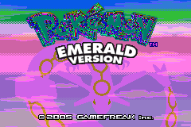

# emerald

Running **Pokémon Emerald** as native host machine code, driven from Go.

> [!WARNING]
> **Status: early and experimental.** It boots and runs up through the title
> sequence and Prof. Birch's introduction, but is unstable beyond that.



This project compiles the [pret/pokeemerald](https://github.com/pret/pokeemerald)
decompilation to native arm64 — not an emulator, the game's own C running
directly — and drives it from Go over a per-frame cgo boundary, rendering
through the [Sapphire](https://github.com/dbut2/sapphire) GBA emulator's PPU and
window. None of this is possible without pokeemerald; this repository is a fork
of it, and the decompilation is vendored as a git subtree under
[`./pokeemerald`](./pokeemerald).

## How it fits together

- `pokeemerald/` — the decomp, vendored as a subtree (the game logic + data).
- `port/` — the host port: shadow headers that redirect GBA hardware to host
  memory, a BIOS/PPU/memory HLE in C, and a converter that turns the decomp's
  assembly data into native-pointer C.
- `internal/core`, `cmd/emerald` — the Go bindings: a single Go binary that runs
  the native core and renders it through Sapphire.

## Build & run

```sh
cd pokeemerald && make modern && cd ..   # asset + header substrate (once)
./port/build.sh                          # compile the native core -> libpe.a
go build -o emerald ./cmd/emerald && ./emerald
```

Keys: **Z**/**X** = A/B, arrows, **Enter** = Start, **Backspace** = Select,
**A**/**S** = L/R, **Space** = fast-forward.

## Status

Early and experimental. It boots and renders the intro and title screen and runs
at native speed. Sound and save are stubbed, and a pointer-width shim for 64-bit
hosts is still needed before the overworld is stable — see
[`docs/native-port.md`](./docs/native-port.md) for the full design and status.
